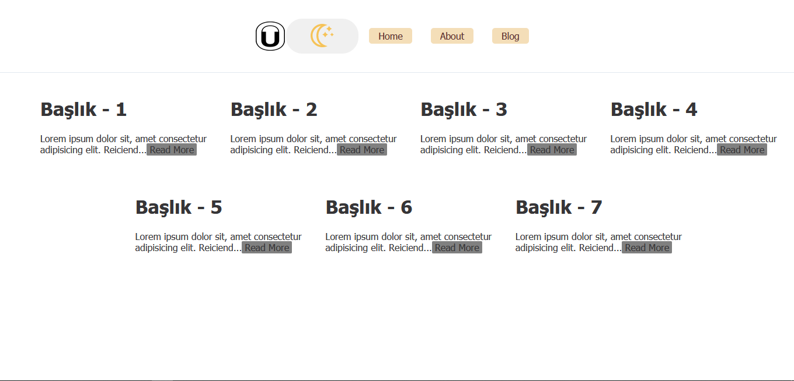

## Demo
[DEMO - CLICK ](https://portfolio-oguzcanuzunoner.surge.sh/)

# Portfolio Uygulaması

Mini bir portfolio uygulaması.

## Proje Teknik Bilgileri

* Dinamik Url yapısı için React-Router-Dom kullanılmıştır.
* Dark Mode vardır.
* Responsive tasarımdır.
* Butonlar ve Kapsayıcı Styled-Component ile oluşturulmuştur.

## Proje Nasıl Çalıştırılır

- Projeyi fork'ladıktan ya da indirdikten sonra projenin bulunduğu klasörde "npm install" komutu ile gerekli paketlerin yüklenmesi gerekiyor.
- Daha sonra "npm run start" komutu ile uygulama başlatılabilir.

 

## Ekran Görüntüsü

### Home Page

  
  

### About

  
  

### Blogs

  
  

### Single Post

  
  

## Licence
---
[MIT](https://choosealicense.com/licenses/mit/)
